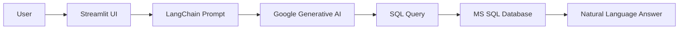

# AI-SQL-Assistant-Streamlit-LangChain-
Transform **natural language questions** into **SQL queries** and get real-time database insights with AI!
## 📌 Overview  
This project is an AI-powered **Natural Language to SQL Query Assistant** built using **LangChain, Google Generative AI, and Streamlit**.  
It allows users to ask questions in **plain English** about the database, automatically converts them into optimized SQL queries, executes them on a **Microsoft SQL Server database**, and returns accurate results in natural language.  
Perfect for **non-technical users, business analysts, and e-commerce inventory management**.
## 🚀 Features  
✅ Convert **natural language** to **SQL queries** using LangChain  
✅ Integrates **Google Generative AI (Gemini 2.5 Flash)** for query generation  
✅ Uses **Few-Shot Prompting with Semantic Similarity** for better accuracy  
✅ Supports **Microsoft SQL Server** database with secure connection  
✅ Interactive **Streamlit dashboard** for user-friendly Q&A experience  
✅ Download **Q&A history as CSV**  
✅ Predefined sample questions + custom input  

**Diagram:**


# 🔍 How It Works

### ✅ Step 1: Streamlit UI – Home Page  
The app provides an interactive dashboard built using **Streamlit** for a smooth user experience.  
From here, you can type your question or choose from predefined queries.  
 


### ✅ Step 2: Ask Your Question  
You can either:  
✔ Type your own question in the text area *(e.g., **How many Nike t-shirts are in size M?**)*  

✔ Or select from predefined sample questions for quick access.  


### ✅ Step 4: View Q&A History  
Every question you ask and the AI’s answer are stored in the **Q&A History** section for easy reference.  
This helps you keep track of previous queries during the session.  


### ✅ Step 5: Download Q&A History  
Download your entire Q&A session as a **CSV file** with one click for further analysis.  

📸 **Screenshot:**  


# ⚡ Setup & Run

### ✅ 1. Clone Repo
```bash
git clone https://github.com/your-username/genai-sql-assistant.git
cd genai-sql-assistant
```
### ✅ 2. Install Dependencies
```bash
pip install -r requirements.txt
```
### ✅ 3. Add API Key

Edit `langchain_helper.py` and add your API key:

```python
api_key = "Insert API key here"
```
✅ 4. Run App
streamlit run app.py

# 🛠 Tech Stack

- **Programming Language:** Python  
- **LLM Orchestration:** LangChain (Prompt Templates, Chains)  
- **Generative AI Model:** Google Generative AI (Gemini 2.5 Flash)  
- **Frontend:** Streamlit  
- **Vector Database:** HuggingFace Embeddings + Chroma DB  
- **Database Connectivity:** PyODBC + SQLAlchemy  
- **Relational Database:** Microsoft SQL Server  
